# Análisis de caso #1 — Plataforma Web Institucional Escalable con Contenedores

**Curso:** BISOF-18 Sistemas Operativos II — Universidad Latina de Costa Rica
**Estudiante:** Esteban
**Ambiente:** WSL2 (Windows) con Docker Engine, HAProxy, OpenSSL

Este documento reúne el análisis técnico y las evidencias del laboratorio en el que se diseñó una plataforma web basada en contenedores Docker, balanceada con HAProxy, evaluando aislamiento de recursos, alta disponibilidad, seguridad y escalabilidad.

---

## 1. Simulación de un servicio en contenedor

### 1.1 Verificación del entorno Docker

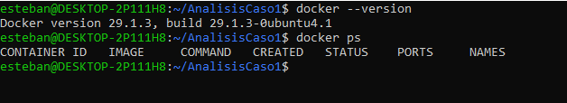

Se confirmó que Docker está correctamente instalado y el daemon responde sin errores, condición necesaria antes de iniciar cualquier despliegue de contenedores.

### 1.2 Dockerfile y contenido del sitio

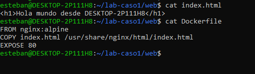

Se creó un Dockerfile básico basado en `nginx:alpine` que copia una página estática "Hola mundo" al directorio servido por Nginx, exponiendo el puerto 80.

### 1.3 Build y ejecución del contenedor

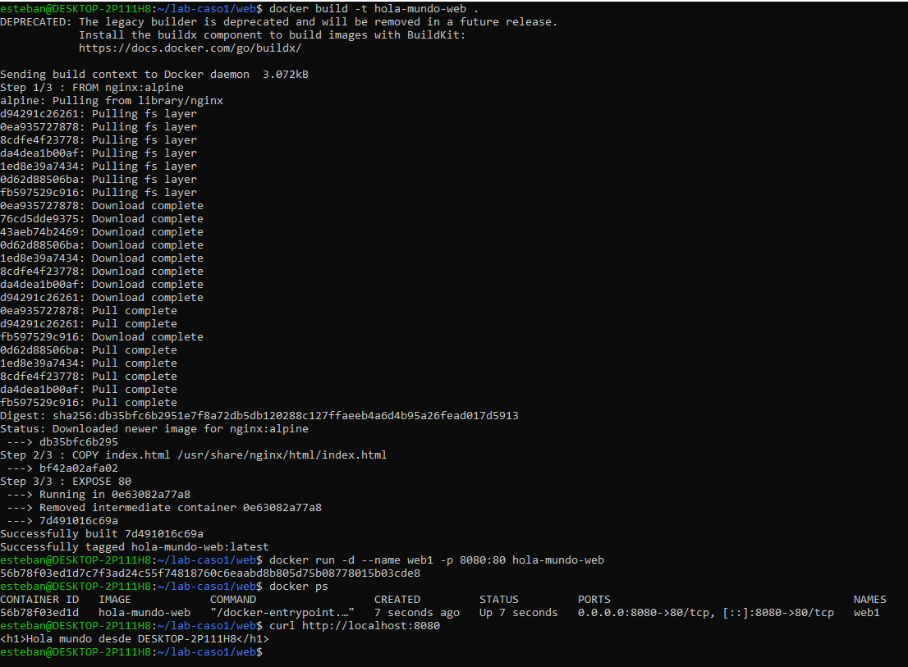

La imagen se construyó correctamente y el contenedor `web1` respondió al `curl` local en el puerto 8080, confirmando que el servicio quedó operativo.

### 1.4 Evaluación de aislamiento de procesos, memoria y persistencia

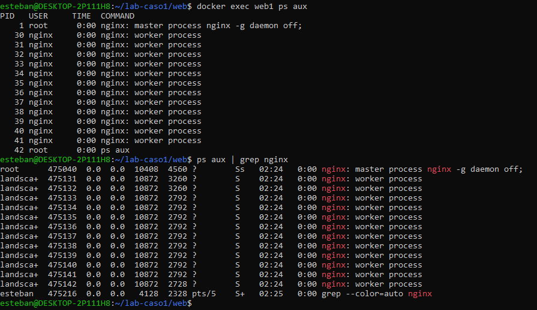

Dentro del contenedor, el proceso maestro de Nginx aparece como PID 1, mientras que en el host WSL2 ese mismo proceso tiene un PID completamente distinto. Esto evidencia que Docker utiliza **namespaces de PID** del kernel de Linux para aislar la vista de procesos de cada contenedor, sin necesidad de virtualización completa.

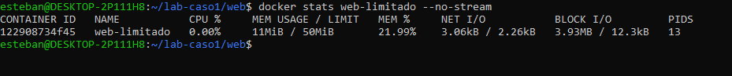

Sin límite explícito, el contenedor `web1` reporta como techo la memoria total del host (7.719GiB). Al forzar `--memory="50m"` en un segundo contenedor, el límite reportado cambia a 50MiB, evidenciando que Docker usa **cgroups** para imponer límites duros de recursos por contenedor.

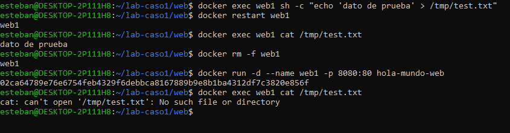

Un archivo escrito dentro del contenedor sobrevive a un `restart` (el filesystem del contenedor no se destruye, solo se reinicia el proceso). Sin embargo, al eliminar el contenedor con `rm -f` y recrearlo, el archivo ya no existe: el filesystem se pierde junto con el contenedor. Esto confirma que, **sin volúmenes, la persistencia de datos en Docker es efímera** por diseño.

### Análisis

- **Aislamiento de procesos:** los namespaces de PID hacen que cada contenedor tenga su propia vista de procesos, independiente del host y de otros contenedores.
- **Aislamiento de memoria:** cgroups permite fijar límites de recursos por contenedor, evitando que uno consuma todos los recursos del host.
- **Persistencia:** por defecto, los contenedores son efímeros; los datos solo sobreviven mientras el contenedor exista. Para persistencia real en producción se requieren volúmenes Docker.

---

## 2. Balanceo de carga

### 2.1 Dos instancias del contenedor web

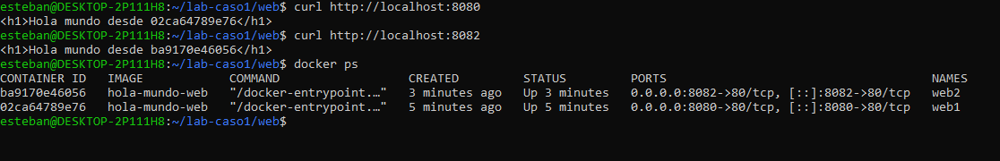

Se levantaron dos instancias (`web1` en el puerto 8080, `web2` en el 8082) a partir de la misma imagen. Cada una responde con su propio identificador de contenedor, lo que permite distinguir visualmente cuál instancia atiende cada petición.

### 2.2 Red Docker compartida

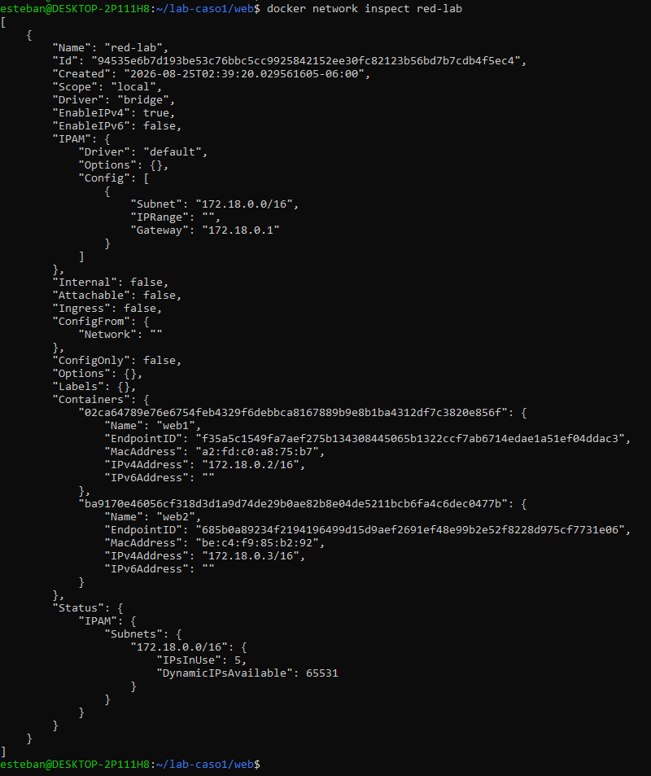

Se creó una red Docker (`red-lab`) y se conectaron ambos contenedores, obteniendo IPs internas (172.18.0.2 y 172.18.0.3) que permiten resolución por nombre entre contenedores de la misma red.

### 2.3 Configuración de HAProxy

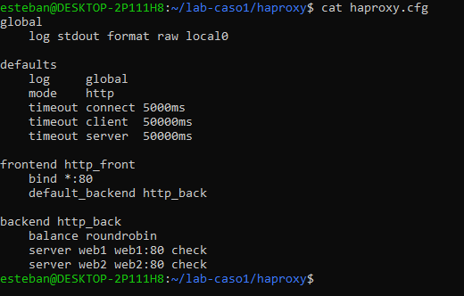

Se configuró un frontend en el puerto 80 y un backend con ambos servidores web, usando el algoritmo `roundrobin` y chequeos de salud (`check`) activos.

### 2.4 Verificación del balanceo de tráfico

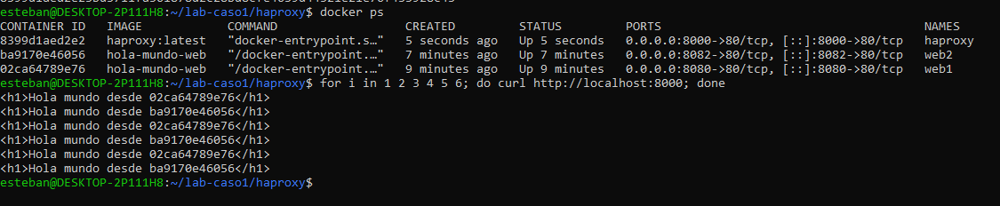

Seis peticiones consecutivas al puerto de HAProxy (8000) mostraron un patrón alternado 1-2-1-2-1-2 entre los identificadores de `web1` y `web2`, confirmando que el balanceo `roundrobin` distribuye el tráfico equitativamente entre ambas instancias.

### Análisis — tipos de balanceo

El algoritmo `roundrobin` reparte las peticiones en orden secuencial estricto, sin considerar la carga actual de cada servidor. Es adecuado cuando las instancias tienen capacidad similar, como en este caso. HAProxy soporta otros algoritmos relevantes para distintos escenarios:

- **`leastconn`**: envía la petición al servidor con menos conexiones activas — útil cuando los tiempos de respuesta varían entre peticiones.
- **`source`**: balancea según un hash de la IP del cliente, garantizando que el mismo cliente caiga siempre en el mismo servidor.
- **`uri`**: hashea según la URL solicitada, útil para escenarios de cache distribuido.

Se eligió `roundrobin` porque el objetivo del laboratorio era demostrar una distribución equitativa simple entre instancias idénticas.

---

## 3. Alta disponibilidad

### 3.1 Simulación de falla y continuidad del servicio

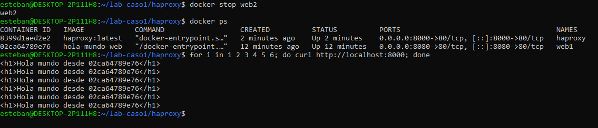

Al detener el contenedor `web2`, las seis peticiones siguientes al balanceador fueron respondidas en su totalidad por `web1`, sin errores visibles para el cliente.

### 3.2 Detección de falla en los logs de HAProxy

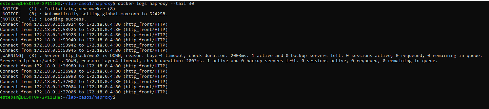

El log de HAProxy muestra el mensaje `Server http_back/web2 is DOWN, reason: Layer4 timeout, check duration: 2003ms`, confirmando que el mecanismo de *health check* detectó la caída en aproximadamente 2 segundos y ajustó el backend a un solo servidor activo.

### Análisis

- **Detección de falla:** HAProxy realiza chequeos activos periódicos (definidos con `check` en la configuración) contra cada servidor del backend. La falla se detectó por timeout de conexión a nivel de capa 4 (TCP).
- **Continuidad del servicio:** al marcar `web2` como `DOWN`, HAProxy dejó de enviarle tráfico automáticamente, redirigiendo el 100% de las peticiones a `web1` sin interrupción visible para el cliente — esto es alta disponibilidad real, donde la falla de una instancia no derriba el servicio completo.
- **Limitación observada:** con solo dos instancias, la caída simultánea de ambas hubiera dejado el servicio completamente inaccesible. En producción se recomienda un mínimo de tres instancias para tolerar múltiples fallas concurrentes.

---

## 4. Seguridad

### 4.1 Generación de certificado SSL auto-firmado

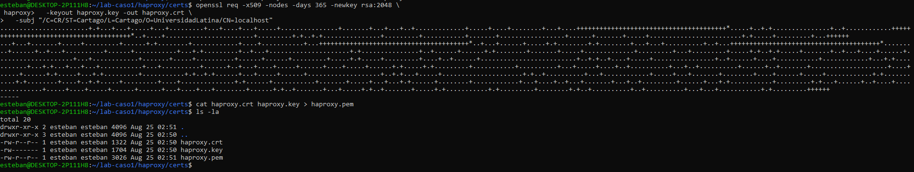

Se generó un certificado auto-firmado con OpenSSL (válido 365 días), combinando clave y certificado en un archivo `.pem` para uso directo en HAProxy.

### 4.2 Configuración de HAProxy para HTTPS

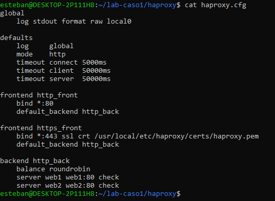

Se añadió un segundo frontend (`https_front`) en el puerto 443, referenciando el certificado generado, manteniendo también el frontend HTTP original para poder comparar ambos protocolos.

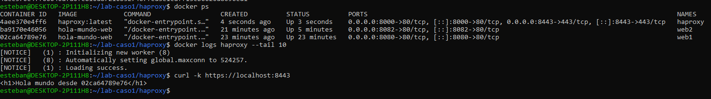

El contenedor de HAProxy quedó expuesto en los puertos 8000 (HTTP) y 8443 (HTTPS), y respondió correctamente a una petición `curl -k` sobre HTTPS.

### 4.3 Comparación de tráfico HTTP plano vs HTTPS

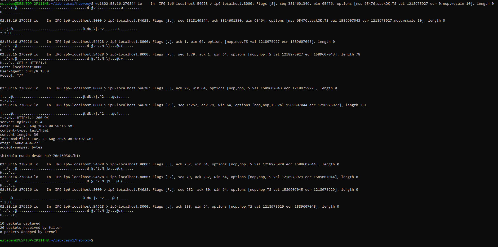

Al capturar tráfico real hacia el puerto 8000 (HTTP), el contenido completo de la petición y la respuesta es legible en texto plano: método, headers, host y el HTML de respuesta.

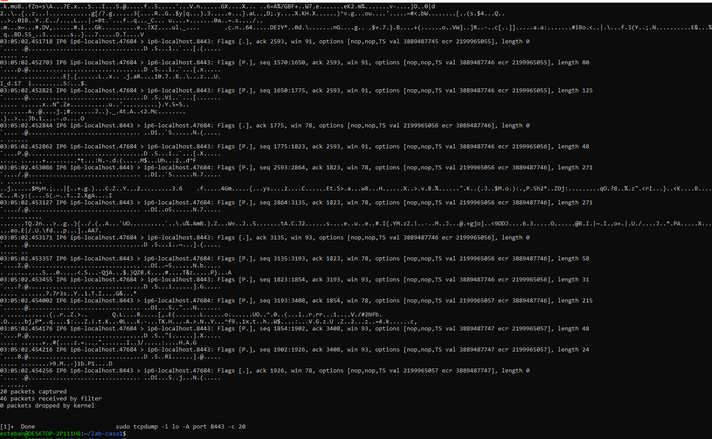

Al capturar tráfico hacia el puerto 8443 (HTTPS), el contenido del payload aparece como bytes sin sentido — solo son legibles los metadatos de la capa de transporte (secuencias TCP, flags), pero no el contenido real de la petición ni de la respuesta.

### Análisis

- **Riesgo de HTTP plano:** cualquier atacante con acceso a la red (por ejemplo, mediante un ataque de intermediario o *sniffing* en una red compartida) puede leer credenciales, cookies de sesión y contenido completo de las peticiones si estas viajan sin cifrar, como se evidenció directamente en la captura de tráfico.
- **Beneficio de HTTPS/TLS:** el cifrado hace que, aunque el tráfico sea interceptado, el contenido resulte inutilizable sin la clave privada correspondiente — se evidenció que el mismo tipo de captura que reveló el HTML completo en HTTP no logró extraer ninguna información legible en HTTPS.
- **Control de acceso y firewalls:** en un despliegue de producción, este esquema de HTTPS en HAProxy se complementaría con reglas de firewall (por ejemplo, restringiendo el puerto 80 solo a redirección hacia 443, o limitando el acceso administrativo por IP) y con controles de acceso a nivel de aplicación (autenticación, roles). Este laboratorio no incluyó una implementación práctica de firewall, por lo que este punto queda documentado como análisis conceptual.

---

## 5. Escalabilidad y mantenimiento

### 5.1 Orquestación declarativa con docker-compose

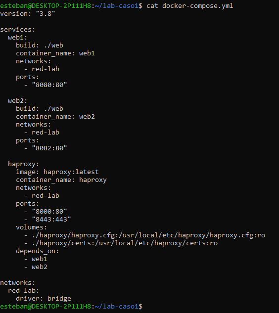

Se definió un `docker-compose.yml` que declara los tres servicios de la plataforma (`web1`, `web2`, `haproxy`) junto con su red y volúmenes de configuración, permitiendo levantar todo el entorno con un solo comando en lugar de ejecutar contenedores individualmente.

### 5.2 Diagrama de arquitectura

El diagrama resume el flujo completo: el cliente accede por los puertos 8000/8443, HAProxy balancea el tráfico hacia `web1` y `web2`, ambos dentro de la red Docker `red-lab`.

### Análisis

- **Comparación con sitios reales en Drupal/WordPress:** ambas plataformas, en producción, suelen desplegarse detrás de un balanceador similar a HAProxy, con múltiples instancias de PHP-FPM y una base de datos compartida (MySQL/MariaDB). La diferencia clave frente a este laboratorio es que Drupal/WordPress requieren **estado compartido** entre instancias (base de datos, sesiones, archivos subidos), mientras que el contenido estático usado aquí no necesitó resolver ese problema.
- **Discusión de Docker Swarm:** Swarm permitiría convertir las instancias fijas de este laboratorio en un servicio replicado (por ejemplo, `docker service scale web=5`), con balanceo y descubrimiento de servicio integrados de forma nativa, y reprogramación automática de contenedores ante la falla de un nodo — llevando la alta disponibilidad lograda manualmente con HAProxy a un nivel de orquestación completo.
- **Mantenimiento:** el uso de `docker-compose.yml` facilita la reproducibilidad del entorno y simplifica tareas de mantenimiento como actualizar imágenes, reiniciar servicios individuales o escalar el número de instancias de forma declarativa.

---

## 6. Conclusiones

- Docker aísla procesos y memoria mediante namespaces y cgroups del kernel de Linux, logrando aislamiento efectivo sin el overhead de una máquina virtual completa.
- Sin volúmenes explícitos, los datos de un contenedor son efímeros y se pierden al eliminarlo — un punto crítico a considerar en cualquier diseño de producción.
- HAProxy con balanceo `roundrobin` distribuye el tráfico de forma equitativa entre instancias idénticas, y sus *health checks* activos permiten alta disponibilidad real: la caída de una instancia no interrumpe el servicio para el cliente.
- La comparación directa de tráfico HTTP vs HTTPS demostró de forma concreta por qué el cifrado es indispensable: el mismo tipo de captura que expuso una petición completa en texto plano no logró extraer ningún dato legible sobre HTTPS.
- Herramientas como `docker-compose.yml` y diagramas de arquitectura convierten un conjunto de contenedores ejecutados manualmente en una plataforma reproducible y fácil de mantener.
- Escalar esta arquitectura hacia una plataforma real (Drupal/WordPress) requeriría resolver el problema del estado compartido entre instancias, algo que este laboratorio no necesitó abordar por usar contenido estático.
