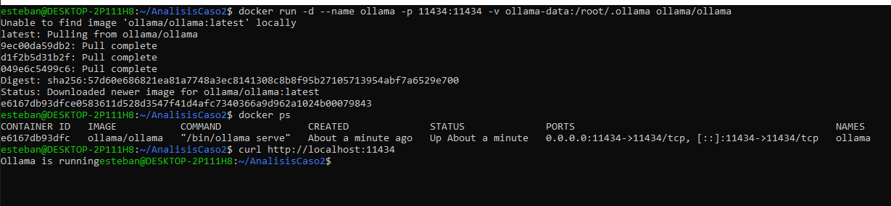
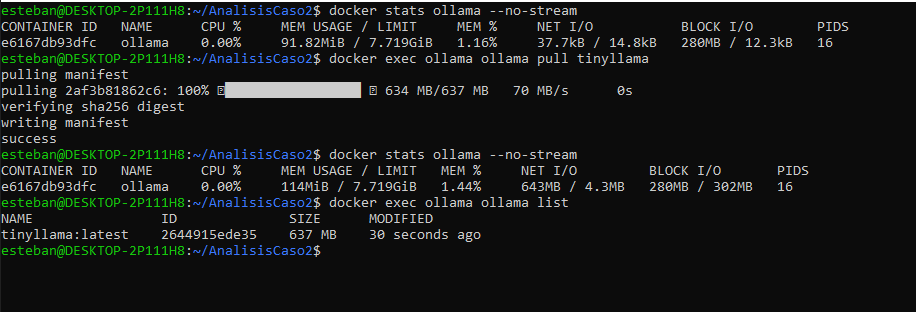
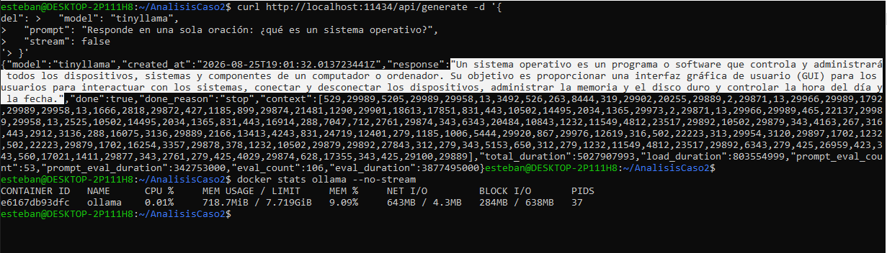
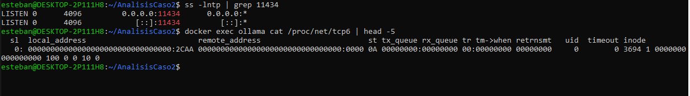
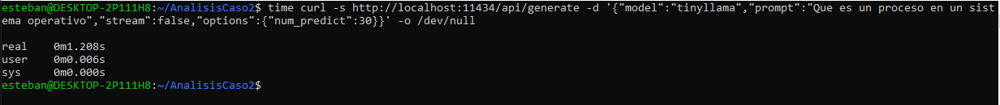
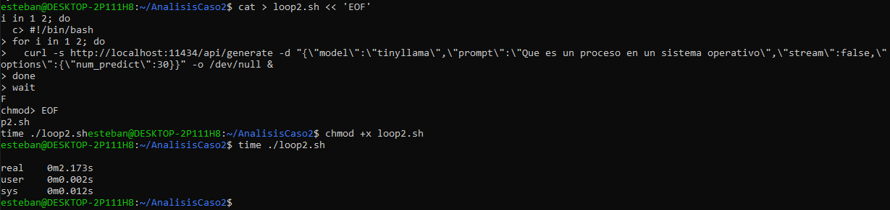
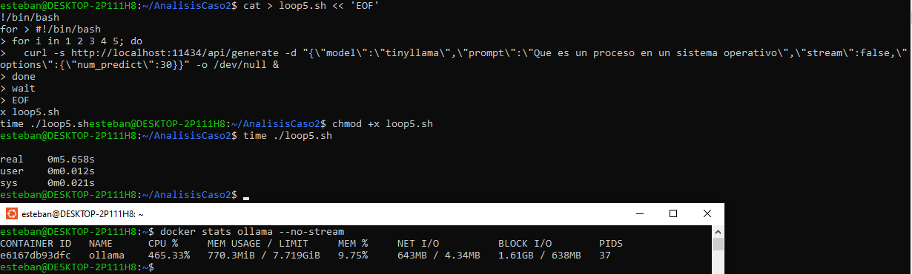
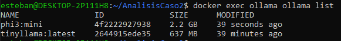
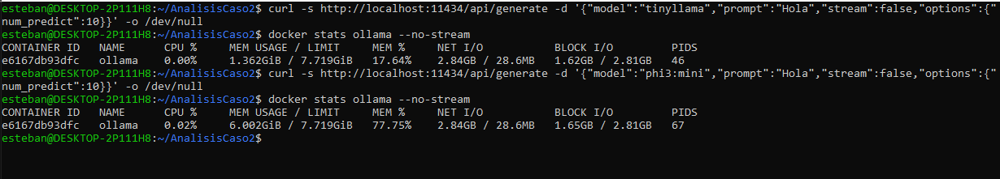
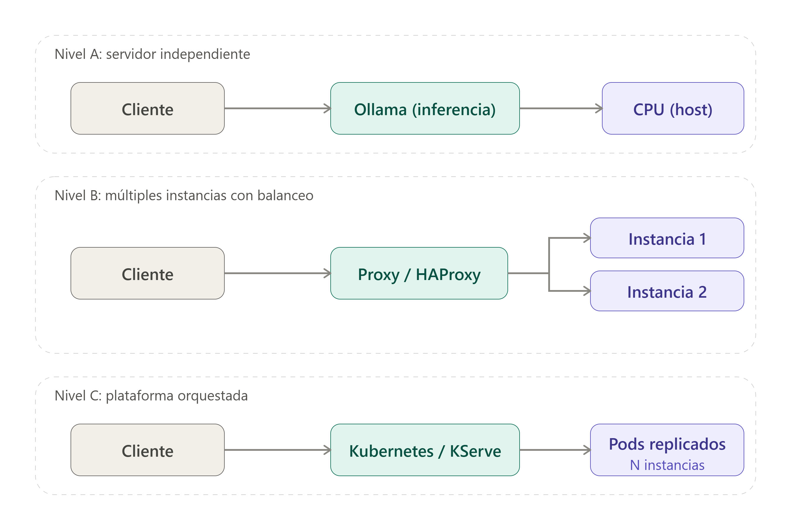

# Análisis de caso #2 — Plataforma de IA como Servicio de Inferencia

**Curso:** BISOF-18 Sistemas Operativos II — Universidad Latina de Costa Rica
**Estudiante:** Esteban
**Ambiente:** WSL2 (Windows), Docker Engine, Ollama (CPU, sin GPU dedicada)

Este documento reúne el análisis técnico y las evidencias de un laboratorio en el que se publicó un modelo de lenguaje como servicio de inferencia, evaluando su comunicación por API HTTP, comportamiento bajo concurrencia, versionado de modelos, y se complementa con un análisis conceptual de disponibilidad, escalabilidad, seguridad y observabilidad de una plataforma de IA institucional.

**Nota de alcance:** siguiendo el criterio de diseño del propio enunciado ("no se espera implementar una plataforma completa de producción"), se optó por Ollama como servidor de inferencia práctico (equivalente funcional simplificado de Triton/vLLM, apto para CPU), y se implementó el **Nivel A** (servidor independiente) de forma práctica con evidencia real. Los Niveles B y C (múltiples instancias orquestadas) se desarrollan como diagrama y análisis conceptual, tal como el enunciado permite explícitamente.

---

## 1. Publicación de un modelo como servicio

### 1.1 Servidor de inferencia corriendo

Se levantó Ollama en un contenedor Docker, exponiendo el puerto 11434. El servidor respondió correctamente a una petición simple, confirmando que el proceso está activo.

### 1.2 Publicación del modelo y consumo de recursos

Antes de descargar el modelo, el contenedor consumía ~91.8MiB de RAM. Tras descargar `tinyllama` (637MB en disco), el consumo apenas subió a ~114MiB — evidenciando que **descargar el modelo al disco no equivale a cargarlo en memoria para inferencia**.

Al ejecutar la primera inferencia real vía API, la memoria saltó de 114MiB a 718.7MiB (incremento de ~600MB, coincidente con el tamaño del modelo), y los PIDs del contenedor subieron de 16 a 37 — el motor de inferencia (llama.cpp por debajo de Ollama) lanzó threads adicionales para ejecutar el cómputo.

### Análisis

- **Proceso que carga el modelo:** el proceso de Ollama dentro del contenedor, que delega el cómputo matemático al motor de inferencia (llama.cpp), visible en el incremento de threads/PIDs.
- **Memoria antes/después:** el salto real de memoria ocurre en el **primer uso** del modelo, no en la descarga — un dato clave para entender cuándo un servidor de inferencia realmente reserva los recursos que va a necesitar.
- **Modelo vs motor de inferencia vs servidor de inferencia:** el **modelo** son los pesos entrenados (`tinyllama:latest`); el **motor de inferencia** es el software que ejecuta el cómputo sobre esos pesos (llama.cpp); el **servidor de inferencia** es Ollama, que expone todo como API HTTP y gestiona la carga/descarga de modelos en memoria.
- **Funciones del sistema operativo involucradas al cargar un modelo:** reserva de memoria virtual para mapear los pesos del modelo, creación de threads/procesos para el motor de inferencia, y planificación de CPU para repartir el cómputo entre los núcleos disponibles.

---

## 2. Comunicación HTTP/API

### 2.1 Puerto y socket de escucha

Se confirmó que Ollama escucha internamente sobre **IPv6** (visible en `/proc/net/tcp6`, puerto `2CAA` hex = 11434 decimal, estado `LISTEN`), mientras que Docker expone el puerto hacia el host en ambas familias (IPv4 y IPv6) mediante `docker-proxy`.

### Análisis

- **Formato de intercambio:** tanto el request como el response usan **JSON** (ver evidencia 03) — el cliente serializa el prompt a JSON antes de enviarlo por el socket TCP, y el servidor deserializa la respuesta del motor de inferencia antes de devolverla.
- **Puertos y sockets:** evidencia real de un socket de escucha en el puerto 11434, aceptando conexiones TCP entrantes — el mecanismo de bajo nivel sobre el que corre HTTP.
- **Similitudes con un servidor web:** ambos exponen una API sobre HTTP, escuchan en un socket TCP, procesan requests concurrentes, y pueden ubicarse detrás de un proxy/balanceador — la diferencia principal es *qué* procesan (texto/HTML vs tensores/tokens) y el costo computacional radicalmente distinto de cada request.
- **HTTP vs gRPC:** este laboratorio usó HTTP/REST (lo que expone Ollama nativamente). gRPC sería útil entre componentes internos de una plataforma de IA porque usa Protocol Buffers (formato binario, más compacto y rápido de serializar que JSON) sobre HTTP/2, con soporte nativo de streaming bidireccional — relevante para enviar tokens generados en tiempo real o para comunicación de alto volumen entre microservicios internos (por ejemplo, entre un gateway y varios servidores de inferencia).

---

## 3. Concurrencia y batching

### 3.1 Línea base y prueba de concurrencia

Se midió el tiempo total de atender 1, 2 y 5 peticiones concurrentes, fijando `num_predict: 30` (mismo número de tokens de salida) para que las mediciones fueran comparables entre sí.

| Peticiones concurrentes | Tiempo total | Throughput aproximado |
|---|---|---|
| 1 | 1.208s | 0.83 req/s |
| 2 | 2.173s | 0.92 req/s |
| 5 | 5.658s | 0.88 req/s |

Durante la prueba de 5 peticiones, `docker stats` mostró el uso de CPU en **465-603%**, confirmando que el contenedor exprime múltiples núcleos por cada inferencia individual.

### Análisis

- **Qué problema resuelve el batching:** agrupar varias solicitudes para procesarlas en un mismo paso de cómputo (por ejemplo, en la misma pasada por la GPU/CPU), amortizando el costo fijo de cada inferencia entre más trabajo útil, en vez de repetirlo por cada solicitud individual.
- **Dynamic batching vs continuous batching (diferencia conceptual):** el *dynamic batching* agrupa solicitudes que llegan dentro de una ventana de tiempo corta y las procesa juntas como un lote fijo; el *continuous batching* (usado por motores como vLLM) permite que nuevas solicitudes se sumen al lote en ejecución token a token, sin esperar a que termine el lote anterior — mucho más eficiente para cargas con solicitudes de distinta longitud.
- **Relación entre batching y planificación de procesos:** ambos resuelven el mismo problema de fondo — repartir un recurso de cómputo limitado entre múltiples tareas que compiten por él — pero el *scheduler* del sistema operativo trabaja a nivel de threads/procesos genéricos, mientras que el batching de un motor de inferencia opera a nivel de tokens/tensores, con conocimiento específico del dominio (por ejemplo, qué solicitudes pueden combinarse en una misma operación matricial).
- **Lo observado en la práctica:** el throughput se mantuvo casi plano (0.83-0.92 req/s) y el tiempo total escaló linealmente con la cantidad de peticiones — la firma de un sistema **CPU-bound sin batching real a nivel de motor**: Ollama sobre CPU con `llama.cpp` no combina múltiples requests independientes en una sola pasada de cómputo, sino que compite por los mismos núcleos. Esto contrasta con lo que se esperaría de vLLM/Triton sobre GPU con continuous batching, donde el throughput escalaría mucho mejor con la concurrencia.
- **Backpressure y colas:** con esta carga (5 peticiones, modelo chico) no se observó rechazo ni degradación abrupta, pero el patrón de escalado lineal sugiere que, sin batching real, el sistema se saturaría rápidamente ante una carga mayor.

---

## 4. Versionado de modelos

### 4.1 Múltiples modelos en el mismo servidor

Se instaló un segundo modelo (`phi3:mini`, 2.2GB) junto al ya existente (`tinyllama:latest`, 637MB), verificando que ambos quedan disponibles simultáneamente como entradas independientes del servidor.

Tras usar ambos modelos, la memoria del contenedor llegó a **6.002GiB (77.75% del límite del host)** — confirmando que Ollama **mantiene ambos modelos cargados en RAM simultáneamente**, sin descargar uno para cargar el otro.

### Análisis

- **Gestión de versiones:** cada modelo es una entrada independiente identificable por nombre y tag, análogo a cómo un *model repository* de Triton organiza modelos en carpetas versionadas.
- **Selección de versión por request:** el cliente especifica el modelo deseado explícitamente en cada petición (campo `"model"` del JSON) — no hay negociación automática de versión.
- **RAM y VRAM con múltiples versiones cargadas:** el consumo de memoria es **acumulativo**, no exclusivo — mantener varias versiones "calientes" en memoria acelera el *rollback* o el cambio entre versiones (no hay que recargar desde disco), pero a costa de un uso de RAM que crece con cada modelo adicional. En un entorno con GPU, el mismo fenómeno ocurriría sobre VRAM, un recurso todavía más limitado y costoso que la RAM del host.
- **Actualización sin interrumpir el servicio:** con este comportamiento observado, un mecanismo de actualización viable sería cargar la nueva versión del modelo en paralelo a la anterior (ambas conviven en memoria, como se evidenció), redirigir gradualmente el tráfico hacia la nueva versión (canary/blue-green a nivel de aplicación o proxy) y descargar la versión anterior solo cuando el tráfico haya migrado por completo — evitando así una ventana de indisponibilidad.

---

## 5. Disponibilidad, escalabilidad y orquestación

### Nivel A — servidor independiente (implementado en este laboratorio)

Corresponde exactamente a lo implementado en las secciones 1-4: un único contenedor Ollama, administrado directamente con Docker, sin balanceo ni réplicas. Es el punto de partida más simple, adecuado para pruebas o cargas bajas, pero con un único punto de fallo.

### Nivel B — múltiples instancias con balanceo (conceptual)

Añadiría un proxy (HAProxy, como el usado en el caso 1) frente a dos o más instancias de Ollama, distribuyendo el tráfico y realizando *health checks* para detectar instancias caídas — la misma lógica de alta disponibilidad ya evidenciada en el caso 1, aplicada ahora a un servidor de inferencia en lugar de un servidor web. El crecimiento horizontal se lograría agregando más instancias detrás del mismo proxy.

### Nivel C — plataforma orquestada (conceptual)

Kubernetes o KServe gestionarían automáticamente el número de réplicas (autoscaling), el enrutamiento de tráfico entre versiones de modelos (traffic splitting, canary deployments), reinicios ante fallas, y podrían escalar a cero instancias cuando no hay demanda — capacidades que en el Nivel A/B se tendrían que resolver manualmente o no existirían en absoluto.

### Alternativa HPC (Slurm)

En un centro de cómputo científico, Slurm reemplazaría a Kubernetes con un enfoque distinto: en vez de orientarse a *servicios* de larga duración (como un servidor de inferencia siempre disponible), Slurm se orienta a la **asignación de recursos para ejecutar trabajos** (jobs de entrenamiento, inferencia batch, o trabajos distribuidos con múltiples GPU) que tienen un inicio y un fin definidos, priorizando el uso eficiente de un clúster compartido entre muchos usuarios.

### Análisis

- **Por qué no siempre es necesario Kubernetes:** para un servicio con carga baja o predecible, con una sola instancia (Nivel A) o un balanceador simple (Nivel B) alcanza — Kubernetes añade complejidad operativa (aprendizaje, mantenimiento del clúster, configuración de manifiestos) que solo se justifica cuando existen requerimientos reales de autoscaling, múltiples equipos/modelos, o alta disponibilidad estricta. Esto es justo el principio de diseño que cita el propio enunciado del caso.
- **Cuándo tendría sentido KServe:** cuando la plataforma necesita servir múltiples modelos con ciclos de vida independientes, requiere autoscaling dinámico (incluyendo escalar a cero para ahorrar GPU cuando no hay tráfico), o necesita desplegar nuevas versiones de modelos de forma gradual (canary) con rollback automático ante errores.
- **Ventajas de Slurm en HPC:** mejor aprovechamiento de recursos compartidos costosos (clústeres de GPU) mediante colas de trabajos con prioridades, soporte nativo para trabajos distribuidos multi-nodo/multi-GPU, y un modelo de "ejecutar y terminar" más eficiente que mantener servicios siempre activos cuando la carga es principalmente de entrenamiento o inferencia batch, no de servicio interactivo continuo.

---

## 6. Seguridad y observabilidad

### Seguridad

- **Autenticación de las API:** en este laboratorio, la API de Ollama quedó expuesta sin autenticación (válido para pruebas locales); en producción se requeriría un mecanismo de API keys o tokens (JWT/OAuth) antes de aceptar cualquier solicitud de inferencia.
- **TLS/HTTPS:** al igual que se evidenció en el caso 1 con HAProxy, el tráfico de inferencia también debería viajar cifrado — un prompt puede contener información sensible (datos personales, secretos corporativos) que no debe circular en texto plano.
- **Control de acceso:** distinguir qué usuarios/aplicaciones pueden invocar qué modelos, evitando que cualquier cliente con acceso a la red pueda consumir recursos de cómputo costosos sin restricción.
- **Protección de credenciales:** las API keys de servicios de IA externos o internos no deben quedar hardcodeadas en el cliente ni en logs — deben gestionarse mediante variables de entorno o un gestor de secretos.
- **Segmentación de red:** el servidor de inferencia debería estar en una red interna no expuesta directamente a internet, accesible solo a través de un gateway/proxy autenticado (siguiendo el mismo patrón de red `red-lab` usado en el caso 1).
- **Aislamiento mediante contenedores:** ya evidenciado en el caso 1 (namespaces de PID, cgroups) — aplica igual aquí: el contenedor de Ollama aísla su espacio de procesos y puede limitarse en CPU/memoria para evitar que consuma todos los recursos del host.
- **Permisos para usar GPU:** en un entorno con GPU compartida entre varios servicios, se requiere un mecanismo de asignación de acceso (por ejemplo, `nvidia-docker` con límites por contenedor) para que un proceso no monopolice la GPU completa.
- **Protección de datos en prompts:** los prompts pueden contener información sensible; un diseño responsable evitaría loguear el contenido completo de los prompts en texto plano, y consideraría políticas de retención/anonimización según el caso de uso.
- **Límites de solicitudes y consumo de recursos:** sin *rate limiting*, un cliente (malicioso o simplemente con un bug) podría saturar el servidor con peticiones concurrentes — algo que se evidenció de forma práctica en la Actividad 3: 5 peticiones ya llevaron el CPU a más de 600%, sin ningún límite que lo evitara.

### Observabilidad

Con las herramientas usadas en este laboratorio (`docker stats`, `curl`, logs de Ollama) ya se cubrieron parcialmente varias de las métricas relevantes:

- **CPU y RAM:** medidas directamente con `docker stats` en las Actividades 1, 3 y 4 (capturas 02, 03, 07, 09).
- **Cantidad de solicitudes y latencia:** medidas con `time` en la Actividad 3 (capturas 05, 06, 07), incluyendo el efecto de la concurrencia sobre el tiempo de respuesta.
- **Carga/descarga de modelos:** evidenciada en el salto de memoria al cargar cada modelo por primera vez (capturas 03 y 09).
- **VRAM y utilización de GPU:** no aplica en este laboratorio al no contar con GPU — en un entorno con GPU se usaría `nvidia-smi` para estas métricas, equivalente a lo que `docker stats` mostró para CPU/RAM.
- **Solicitudes en espera, errores:** no se instrumentó una cola visible ni se generaron errores en las pruebas — en un despliegue real, estas métricas se obtendrían de los logs del servidor de inferencia o de un sistema como Prometheus/Grafana, que no se implementaron en este laboratorio por no ser necesarios para demostrar los conceptos centrales pedidos.
- **Métricas para determinar saturación:** CPU sostenido cerca del 100% (o del total de núcleos disponibles, como se vio con el 600% en 5 peticiones concurrentes), throughput que deja de crecer pese a más carga (justo lo observado en la tabla de la Actividad 3), y latencia por solicitud que empieza a crecer de forma no lineal, son las señales más directas de que una plataforma de inferencia está saturada.

---

## 7. Analogía con una plataforma web o de bases de datos

| Base de datos | Plataforma web | Plataforma de IA (este laboratorio) |
|---|---|---|
| Base de datos | Aplicación / contenido | Modelo (`tinyllama`, `phi3:mini`) |
| Motor de almacenamiento/ejecución | Runtime PHP/JVM/Node | Motor de inferencia (llama.cpp) |
| PostgreSQL/MariaDB Server | Apache/Nginx/Tomcat | Ollama (equivalente simplificado de Triton/vLLM) |
| SQL / protocolo PostgreSQL | HTTP/REST | HTTP (API de Ollama) |
| Pool de conexiones | Workers/threads | Cola y batching (limitado en Ollama/CPU, real en vLLM/Triton) |
| Versiones/esquemas | Releases de aplicación | Versiones de modelos (`tinyllama:latest`, `phi3:mini`) |
| HA/replicación | Balanceadores/réplicas | Réplicas de inferencia (Nivel B, conceptual) |
| Operator/Kubernetes | Kubernetes/Swarm | KServe/Kubernetes (Nivel C, conceptual) |

Esta analogía ayuda a distinguir responsabilidades: así como una aplicación web no reimplementa la lógica de un motor de base de datos, un cliente de IA no reimplementa la lógica de inferencia — ambos delegan a un servidor especializado detrás de una API bien definida.

---

## 8. Preguntas de análisis

1. **¿Diferencia entre modelo, motor de inferencia y servidor de inferencia?** El modelo son los pesos entrenados; el motor de inferencia es el software que ejecuta el cómputo sobre esos pesos; el servidor de inferencia expone todo como API y gestiona el ciclo de vida de los modelos en memoria (ver Actividad 1).
2. **¿Qué funciones del SO intervienen al cargar un modelo?** Reserva de memoria virtual, creación de threads/procesos para el motor de inferencia, y planificación de CPU (evidenciado en el salto de PIDs de 16 a 37, captura 03).
3. **¿Qué ocurre con RAM/VRAM al mantener varias versiones de un modelo?** El consumo es acumulativo, no exclusivo — cada modelo cargado suma su huella de memoria, como se evidenció al llegar a 77.75% del host con solo dos modelos chicos (captura 09).
4. **¿Similitudes entre un servidor de inferencia y un servidor web?** Ambos exponen API sobre HTTP, escuchan en un socket TCP, atienden requests concurrentes y pueden ubicarse detrás de un proxy/balanceador (ver Actividad 2 y la analogía de la sección 7).
5. **¿Por qué gRPC puede ser útil entre componentes de una plataforma de IA?** Usa formato binario (Protocol Buffers) más compacto que JSON y soporta streaming bidireccional nativo sobre HTTP/2 — útil para comunicación interna de alto volumen o para transmitir tokens generados en tiempo real.
6. **¿Qué problema intenta resolver el batching?** Amortizar el costo fijo de cada inferencia procesando varias solicitudes en un mismo paso de cómputo, en vez de repetirlo individualmente por cada una.
7. **¿Diferencia entre dynamic batching y continuous batching?** El dynamic batching agrupa solicitudes en una ventana de tiempo y las procesa como lote fijo; el continuous batching permite sumar nuevas solicitudes al lote en ejecución sin esperar a que termine el anterior.
8. **¿Relación entre batching y planificación de procesos?** Ambos reparten un recurso de cómputo limitado entre tareas que compiten por él, pero el scheduler del SO opera a nivel de threads/procesos genéricos, mientras que el batching opera a nivel de tokens/tensores con conocimiento específico del dominio.
9. **¿Por qué no siempre es necesario usar Kubernetes?** Para cargas bajas o predecibles, un servidor independiente (Nivel A) o un balanceador simple (Nivel B) alcanza — Kubernetes añade complejidad operativa que solo se justifica con requerimientos reales de autoscaling o alta disponibilidad estricta.
10. **¿Cuándo tendría sentido agregar KServe?** Cuando se necesita servir múltiples modelos con autoscaling dinámico (incluyendo escalar a cero), o desplegar versiones nuevas de forma gradual con rollback automático.
11. **¿Ventajas de Slurm en un entorno HPC?** Mejor aprovechamiento de clústeres de GPU compartidos mediante colas de trabajos con prioridades, soporte nativo para trabajos distribuidos multi-GPU, y un modelo de ejecución más eficiente para cargas batch que mantener servicios siempre activos.
12. **¿Riesgos si múltiples usuarios comparten una GPU?** Contención de recursos (un usuario puede monopolizar la VRAM o el cómputo), posible filtración de datos entre procesos si el aislamiento no es adecuado, y degradación de latencia para todos los usuarios si no hay límites ni planificación.
13. **¿Qué métricas indicarían saturación de una plataforma de inferencia?** CPU/GPU sostenidos cerca del máximo, throughput que deja de crecer pese a más carga concurrente (justo lo observado en la Actividad 3), y latencia por solicitud creciendo de forma no lineal.
14. **¿Cómo actualizar un modelo sin interrumpir el servicio?** Cargar la nueva versión en paralelo a la anterior (ambas conviven en memoria, como se evidenció en la Actividad 4), migrar el tráfico gradualmente (canary/blue-green), y descargar la versión anterior solo al finalizar la migración.
15. **¿Qué componentes adicionales convertirían este prototipo en un servicio institucional?** Autenticación y control de acceso a la API, HTTPS/TLS, un balanceador con health checks (Nivel B), observabilidad real con Prometheus/Grafana, límites de tasa de solicitudes, y — según la escala requerida — orquestación con Kubernetes/KServe (Nivel C).

---

## 9. Conclusiones

- Un servidor de inferencia como Ollama replica, a menor escala, los mismos conceptos de sistemas operativos vistos en un servidor web tradicional: procesos, memoria, sockets, concurrencia — pero con un patrón de consumo de recursos mucho más intensivo por request.
- La carga de un modelo en memoria ocurre en el primer uso, no en la descarga — un detalle importante para dimensionar cuándo un servidor realmente reserva los recursos que va a necesitar.
- Sin batching real a nivel de motor de inferencia (como sí ofrecen vLLM/Triton sobre GPU), la concurrencia sobre CPU no mejora el throughput: el tiempo total escala casi linealmente con la cantidad de peticiones, evidenciando un sistema CPU-bound sin margen de paralelismo adicional.
- Mantener múltiples versiones de un modelo cargadas simultáneamente acelera el cambio entre ellas (útil para rollback), pero el consumo de memoria es acumulativo y puede convertirse rápidamente en el recurso limitante — con solo dos modelos chicos ya se alcanzó un 77.75% de uso del host.
- La decisión entre servidor independiente, múltiples instancias balanceadas, o una plataforma orquestada con Kubernetes/KServe debe basarse en requerimientos reales de disponibilidad y escala — no toda plataforma de IA institucional necesita el nivel más complejo desde el primer día.
- Seguridad y observabilidad, aunque no se implementaron en profundidad en este laboratorio, son componentes no negociables para llevar un prototipo como este a un servicio institucional real: sin autenticación, TLS, límites de solicitudes y métricas, un despliegue de este tipo queda expuesto tanto a abuso de recursos como a fuga de información sensible en los prompts.
