# Laboratorio 3 — Observabilidad del kernel con eBPF en WordPress HA

**Curso:** Sistemas Operativos 2
**Estudiante:** Esteban Hernández
**Ambiente:** Ubuntu 24.04/26.04 sobre WSL2 + Docker Compose

Este documento presenta la evidencia de la observación, mediante `bpftrace` y `strace`
ejecutados directamente sobre el host WSL2, del comportamiento del kernel Linux frente
al stack WordPress en alta disponibilidad construido en el laboratorio anterior
(HAProxy + `web1`/`web2` + Redis + MariaDB).

---

## 1. Preparación del ambiente

### 1.1 Sistema operativo y kernel

Se validó que el laboratorio corre sobre WSL2 con el kernel
`microsoft-standard-WSL2`, condición necesaria para las limitaciones descritas más
adelante respecto a la resolución de PIDs en namespaces.

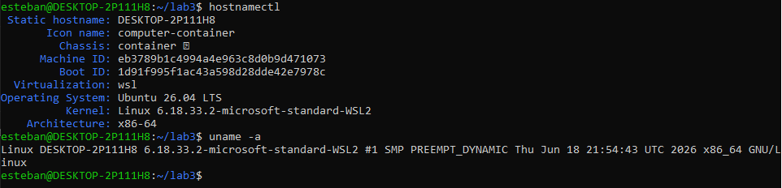

### 1.2 Soporte de eBPF

Se confirmó la disponibilidad de BTF (`/sys/kernel/btf/vmlinux`) y de los tracepoints
necesarios (`syscalls:sys_enter_*`, `sched:*`, `block:*`), sin necesidad de montar
manualmente `tracefs`/`debugfs`.

### 1.3 Stack WordPress HA levantado

Como el laboratorio anterior se había detenido con `docker compose down -v`
(eliminando los volúmenes de MariaDB y Redis), se reinstaló WordPress reutilizando los
mismos archivos de código en `/home/orh`, conservando `wp-config.php` y la
configuración de Redis Object Cache y del backend indicador.

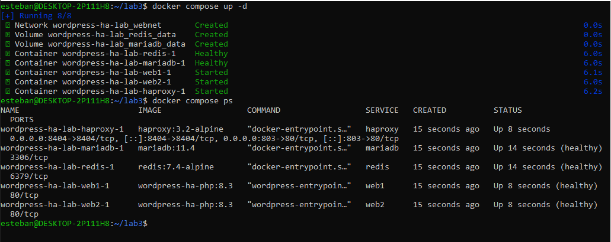

---

## 2. Práctica 1 — Relacionar contenedores con procesos reales

### 2.1 PID real de cada contenedor

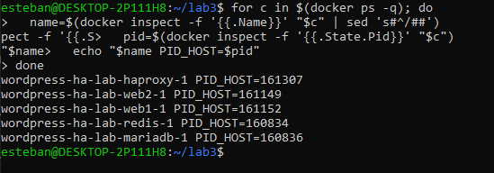

### 2.2 Los mismos procesos, vistos desde `ps` en el host

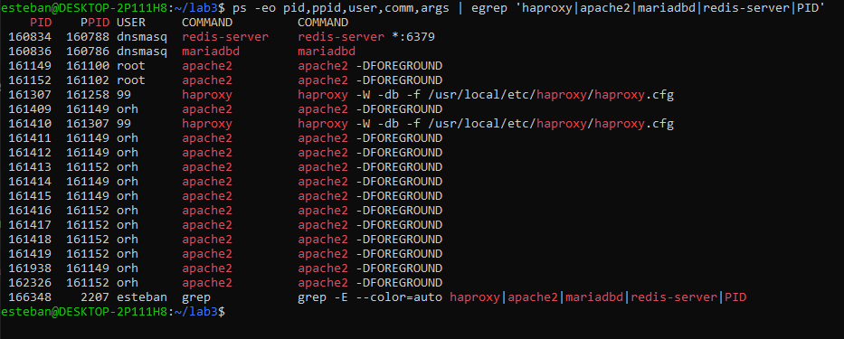

### 2.3 Namespaces de HAProxy

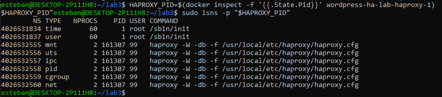

### Análisis

1. **¿El contenedor tiene un kernel propio?** No. Todos los contenedores comparten el
   mismo kernel Linux del host WSL2, evidenciado porque sus PIDs son directamente
   visibles y coinciden entre `docker inspect` y `ps` del host.
2. **¿Por qué HAProxy aparece como un proceso normal del sistema?** Porque
   literalmente lo es: un contenedor no crea una máquina separada, solo aísla un
   proceso Linux existente mediante namespaces.
3. **¿Qué namespaces se observan?** `mnt`, `uts`, `ipc`, `pid`, `cgroup` y `net`
   exclusivos del contenedor; `time` y `user` se comparten con el host.
4. **¿Qué relación hay entre el proceso del contenedor y los cgroups?** El cgroup
   asociado al PID limita y contabiliza los recursos (CPU, memoria, I/O) que ese
   proceso puede consumir; es el mecanismo que impone los límites definidos por
   Docker.

---

## 3. Práctica 2 — Observar creación de procesos

### 3.1 `sched_process_fork` / `sched_process_exec` durante `docker compose exec`

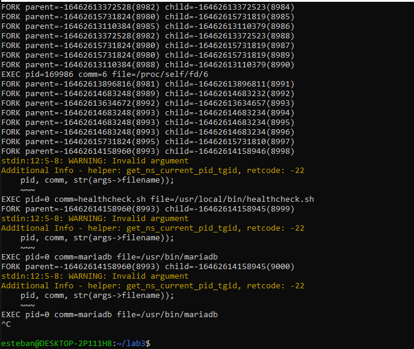

> **Nota técnica:** en WSL2, `bpftrace` reporta de forma esporádica
> `WARNING: Invalid argument (get_ns_current_pid_tgid, retcode: -22)` al intentar
> traducir el PID dentro del namespace del contenedor. Es una limitación conocida del
> kernel `microsoft-standard-WSL2` (soporte incompleto de namespaces de PID), no un
> error de configuración del laboratorio. Los eventos `EXEC` con nombre de comando
> (`comm=...`) siguen siendo legibles e informativos a pesar de esta advertencia.

### 3.2 `sched_process_exec` filtrado durante tráfico HTTP real

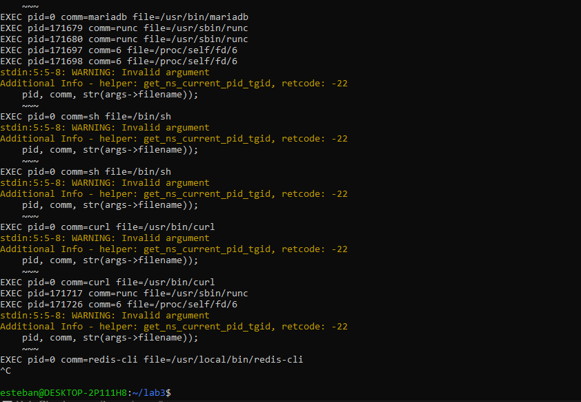

### Análisis

`docker compose exec` genera eventos de creación y ejecución de procesos en el host
porque un contenedor no es una máquina aislada con su propio kernel, sino un conjunto
de procesos Linux normales. Cada `docker exec` hace que el runtime de contenedores
(`runc`, visible en la traza) cree un proceso hijo real en el árbol de procesos del
host, solo que con namespaces distintos. Por eso el kernel del host —y por tanto
`bpftrace`— observa ese `fork`/`exec` como cualquier otro evento del sistema.

---

## 4. Práctica 3 — Contar llamadas al sistema durante tráfico HTTP

### 4.1 Syscalls por proceso, sin filtro

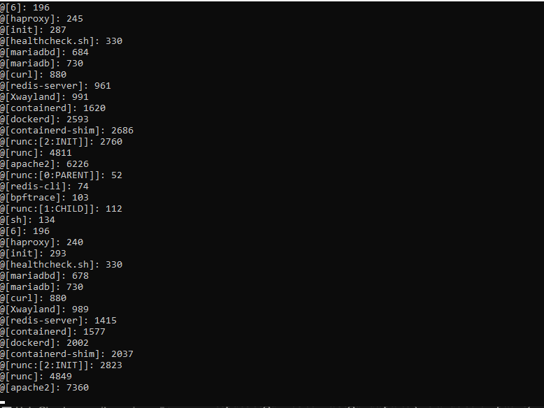

### 4.2 Syscalls filtradas solo para Apache

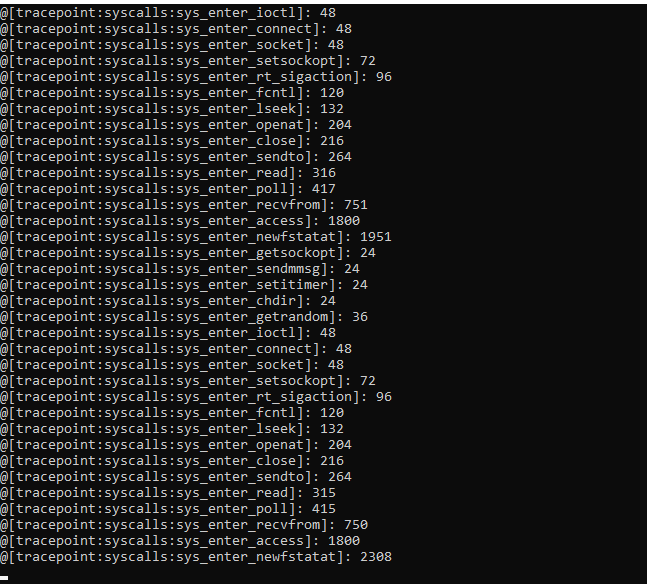

### Análisis

1. **¿Qué procesos generan más llamadas al sistema?** `apache2`, y en segundo plano
   los componentes de infraestructura de Docker (`dockerd`, `containerd`, `runc`).
2. **¿Por qué aparece `curl` si la aplicación está en contenedores?** Porque `curl`
   corre en el host WSL2, generando las syscalls de red que inician cada solicitud;
   el kernel ve ambos lados (cliente y servidor) porque comparten el mismo kernel.
3. **¿Por qué puede aparecer `apache2`, `haproxy`, `redis-server` o `mariadbd`?**
   Porque, como en la Práctica 1, todos son procesos Linux normales sobre el mismo
   kernel del host, aunque aislados por namespaces.
4. **¿Qué indica que un proceso tenga muchas llamadas `futex`, `epoll_wait`, `read` o
   `write`?** Indica un proceso orientado a I/O y concurrencia: `epoll_wait`/`futex`
   son típicos de servidores que multiplexan muchas conexiones simultáneas, y
   `read`/`write` reflejan el tráfico de datos entrante y saliente.

---

## 5. Práctica 4 — Observar apertura de archivos por Apache

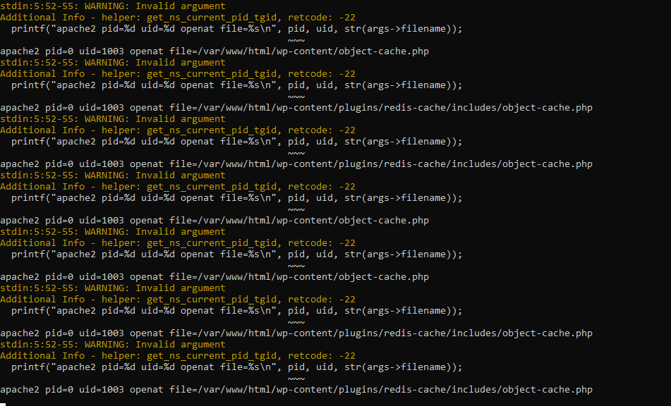

### Análisis

Cada `openat` ocurre con `uid=1003`, coincidiendo exactamente con el `www-data`
reconfigurado dinámicamente por el `entrypoint` del Laboratorio 2 — evidencia directa
de que el ajuste de identidad sigue vigente en tiempo de ejecución. Los archivos
abiertos (`wp-content/object-cache.php`,
`wp-content/plugins/redis-cache/includes/object-cache.php`) muestran, a nivel de
kernel, cómo PHP carga el *drop-in* de Redis Object Cache en cada solicitud, todo bajo
el mismo bind mount de `/home/orh`.

---

## 6. Práctica 5 — Comparar `strace` y eBPF

### 6.1 Relación maestro/worker de HAProxy

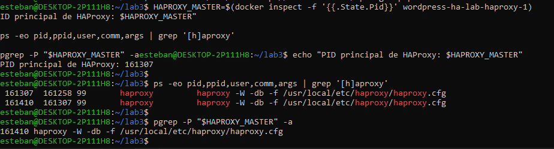

### 6.2 `strace` adjunto a maestro y worker durante una solicitud

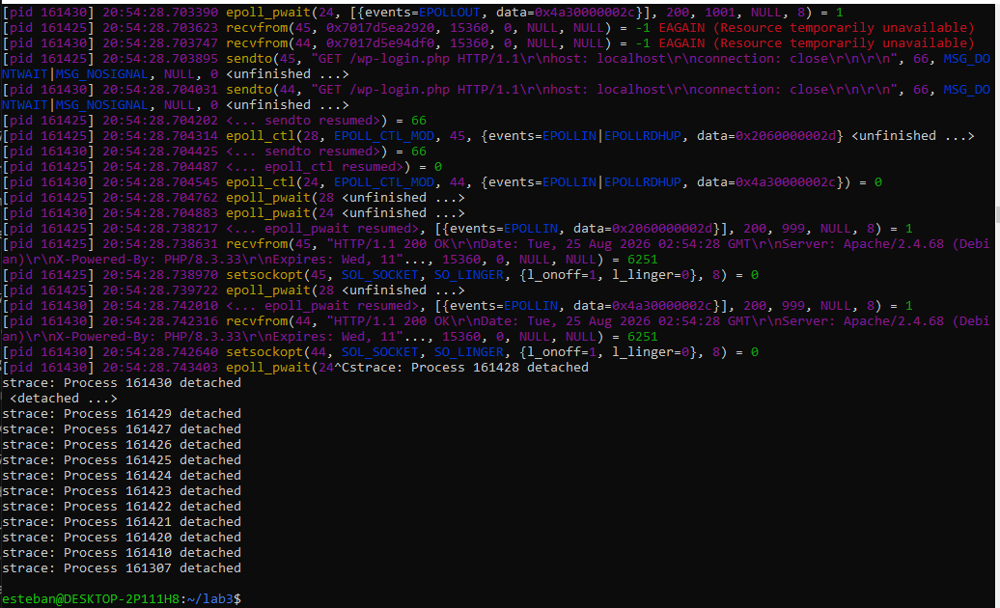

### 6.3 eBPF observando eventos de red globales del sistema

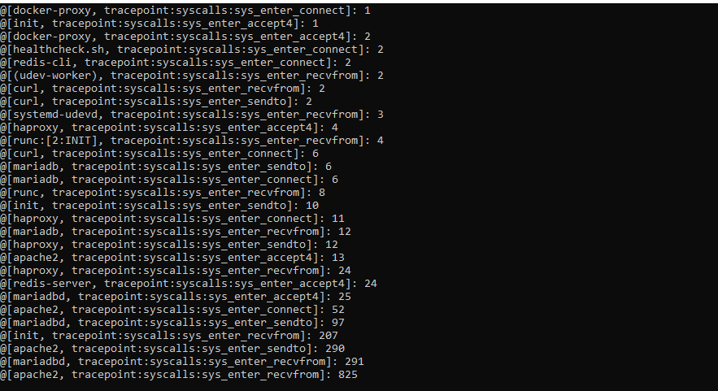

### Análisis

1. **¿Cuál proceso muestra más actividad: el maestro o el worker?** El worker — es
   quien realmente atiende las conexiones; el maestro solo supervisa.
2. **¿Por qué aparece `epoll_wait()` en servidores de red como HAProxy?** Porque
   HAProxy es un servidor basado en eventos que multiplexa miles de conexiones
   simultáneas con pocos hilos usando `epoll`, en vez de un proceso/hilo por
   conexión.
3. **¿Qué diferencia hay entre adjuntarse a un PID específico y observar eventos
   globales del kernel?** `strace` solo ve lo que hace ese proceso puntual (o su árbol
   de hijos); si solo te adjuntas al maestro, no se observa nada relevante. `bpftrace`
   ofrece una vista agregada de todo el sistema simultáneamente, sin necesidad de
   saber de antemano a qué PID conectarse.

| Herramienta | Alcance | Ventaja | Limitación |
|---|---|---|---|
| `strace` | Un proceso o árbol de procesos | Detalle exacto de cada syscall | Puede no mostrar nada si se adjunta al PID equivocado |
| `bpftrace` | Eventos globales del kernel, con filtros | Observabilidad amplia de todo el sistema | Requiere privilegios y conocimiento de eventos del kernel |

---

## 7. Práctica 6 — Observar conexiones TCP

### 7.1 Conteo de `connect()` por proceso

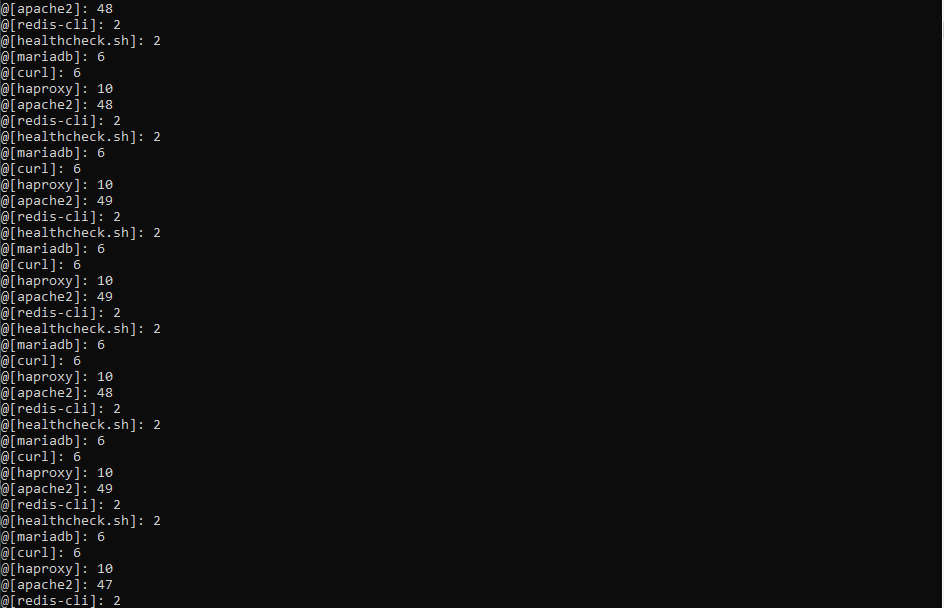

### 7.2 Red interna de Docker

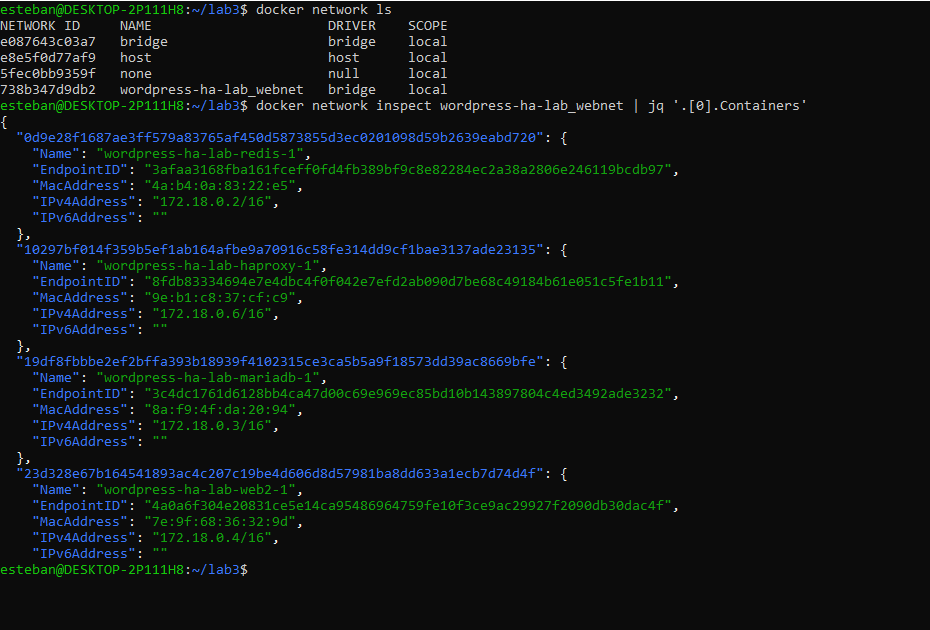

### 7.3 Verificación de sockets con `ss`

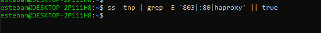

> **Nota:** la verificación con `ss -tnp` no mostró resultados al ejecutarse fuera de
> una ventana activa de tráfico, dado que las conexiones se cerraban inmediatamente
> por usar `Connection: close`. Esto es en sí mismo evidencia de la diferencia entre
> una traza de eventos en tiempo real (`bpftrace`) y una consulta puntual del estado
> de los sockets (`ss`): una traza de eventos captura conexiones aunque sean
> efímeras, mientras que una consulta de estado solo ve lo que sigue abierto en el
> instante exacto en que se ejecuta.

### Análisis

1. **¿Qué procesos invocan `connect()`?** `apache2`, `haproxy`, `curl`, `mariadb`,
   `redis-cli`, `healthcheck.sh`.
2. **¿Por qué algunas conexiones parecen locales?** Porque todos los contenedores
   corren en la misma red bridge `wordpress-ha-lab_webnet` dentro del mismo host
   WSL2; las IPs `172.18.0.x` son internas a esa red virtual.
3. **¿Qué diferencia hay entre una conexión cliente-HAProxy y una conexión
   HAProxy-backend?** La primera llega desde fuera vía el puerto publicado `803`; la
   segunda es HAProxy actuando como cliente hacia `web1`/`web2` dentro de la red
   interna — dos conexiones TCP independientes, unidas lógicamente por HAProxy.
4. **¿Qué aporta `bpftrace` y qué aporta `ss`?** `bpftrace` muestra el evento de
   apertura de conexión en el instante en que ocurre; `ss` muestra el estado actual de
   los sockets, por lo que conexiones muy breves pueden no capturarse si no coincide
   el momento exacto de la consulta.

---

## 8. Práctica 7 — Sesiones PHP con Redis

Se creó un script PHP temporal que fuerza `session_start()` para validar
explícitamente el uso de Redis como backend de sesiones (WordPress, por sí solo, no
usa sesiones PHP nativas para el login).

### 8.1 Contador de sesión persistente a través de ambos backends

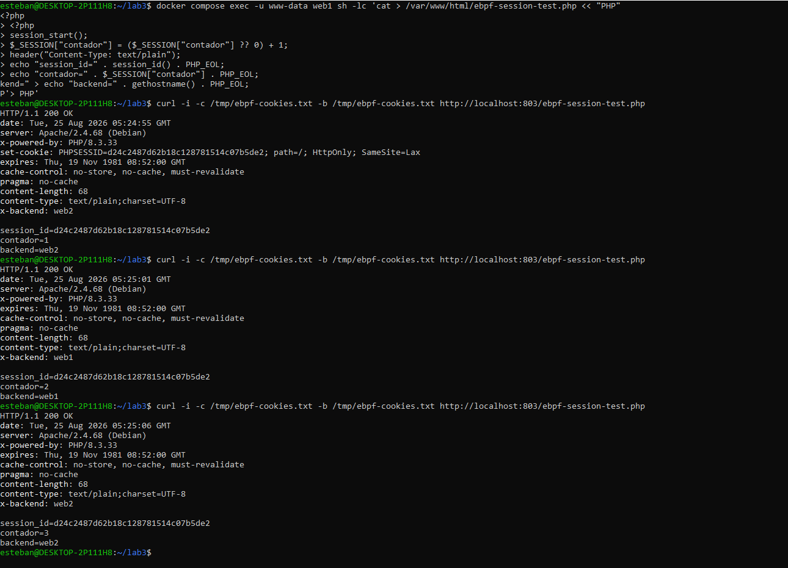

El mismo `session_id` se mantuvo constante en las tres solicitudes
(`contador=1` → `backend=web2`, `contador=2` → `backend=web1`,
`contador=3` → `backend=web2`), aunque HAProxy alternó el backend en cada una.

### 8.2 Clave de sesión almacenada en Redis

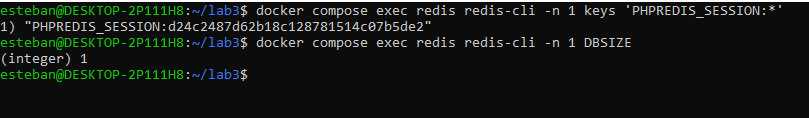

### Análisis

1. **¿Por qué Redis permite que la sesión sobreviva aunque HAProxy envíe solicitudes
   a `web1` o `web2`?** Porque ninguna réplica guarda el estado de sesión localmente;
   ambas leen y escriben en el mismo servidor Redis central, así que el `session_id`
   es válido sin importar cuál las atienda.
2. **¿Qué problema habría si las sesiones se guardaran solo en archivos locales
   dentro de cada contenedor web?** El problema clásico de sesión "pegajosa": si
   `web1` crea la sesión en su disco local y la siguiente solicitud llega a `web2`,
   este no encontraría esos datos, y el usuario parecería desconectado cada vez que
   cambia el backend.
3. **¿Qué relación tiene esto con alta disponibilidad?** Es la diferencia entre alta
   disponibilidad real y solo redundancia de procesos: sin estado compartido, tener
   dos réplicas no evita interrupciones perceptibles para el usuario — Redis es lo que
   hace transparente el *failover*.

---

## 9. Práctica 8 — Observar actividad de disco

Se generó escritura simultánea en los tres sistemas con persistencia: WordPress
(`/home/orh`), Redis (AOF + `BGSAVE`) y MariaDB (creación de base de datos e inserción
masiva de filas).

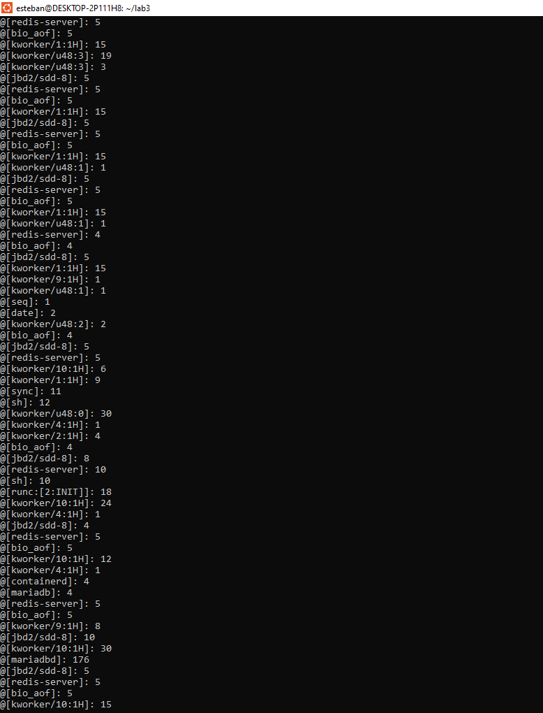

### Análisis

1. **¿Cuál operación produjo más actividad de bloque?** La de MariaDB
   (`mariadbd`), por el `INSERT` masivo de 500 filas con índice `AUTO_INCREMENT`.
2. **¿La actividad de disco observada corresponde únicamente al contenedor?** No —
   aparece mezclada con hilos del kernel (`jbd2`, `kworker`), confirmando que no hay
   aislamiento de I/O a nivel de kernel: todos los contenedores comparten el mismo
   subsistema de bloque del host.
3. **En WSL2, ¿qué capas adicionales podrían influir en la latencia?** El disco
   virtual de WSL2 (`.vhdx` sobre NTFS del host Windows) añade una capa de traducción
   entre el ext4 "virtual" y el sistema de archivos real de Windows.
4. **¿Por qué una escritura dentro del contenedor termina observándose como
   actividad del kernel compartido?** Porque el contenedor no tiene su propio
   subsistema de bloque; todas las escrituras pasan por el mismo *page cache*,
   *journal* (`jbd2`) y controlador de bloque del host.

---

## 10. Práctica 9 — Observar planificación de CPU

Se generó carga CPU-bound (hashing SHA-256 en bucle) durante 10 segundos en `web1` y
luego en `web2`, observando `sched:sched_switch` y comparando con `docker stats`.

### 10.1 Cambios de contexto por proceso

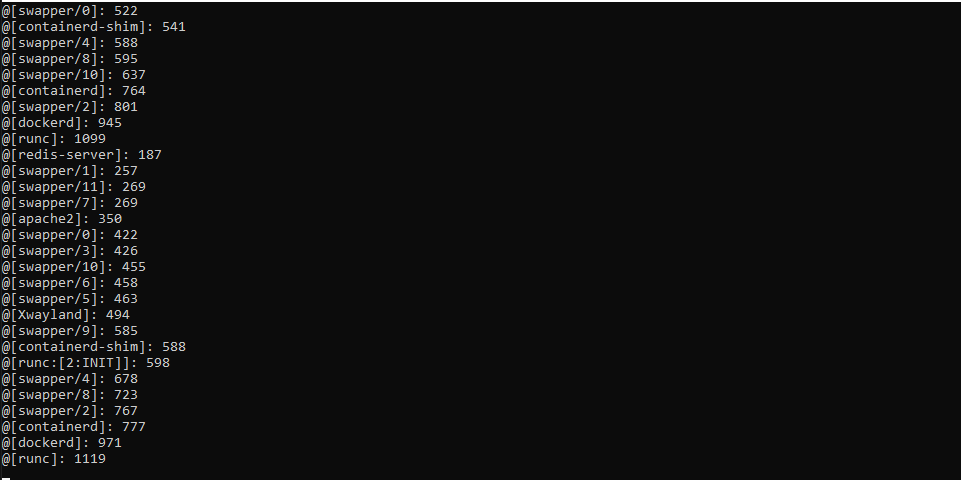

### 10.2 Consumo de recursos por contenedor

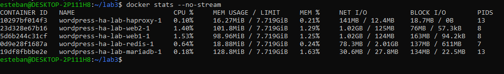

### Análisis

1. **¿El planificador agenda contenedores o procesos/hilos?** Procesos/hilos
   individuales; el planificador de Linux no tiene noción de "contenedor" como
   entidad.
2. **¿Qué procesos aparecen con mayor cantidad de cambios de contexto?**
   `swapper/N` (idle de cada CPU) y procesos de infraestructura (`runc`, `dockerd`,
   `containerd`) — no el proceso PHP bajo carga.
3. **¿Cómo se relaciona esto con cargas CPU-bound, I/O-bound y tiempo de
   respuesta?** Un proceso CPU-bound (el hashing en bucle) genera pocos
   `sched_switch` porque no cede el CPU voluntariamente; un proceso I/O-bound (como
   Apache esperando red) genera muchos, porque se bloquea constantemente en
   `epoll_wait`/`read` y cede el CPU a otros.
4. **¿Por qué `docker stats` y `bpftrace` muestran perspectivas distintas del mismo
   fenómeno?** `docker stats` mide consumo acumulado de recursos por contenedor;
   `bpftrace` con `sched_switch` mide eventos de planificación en tiempo real, y ambas
   métricas no siempre se correlacionan directamente, como demuestra este caso.

---

## 11. Práctica 10 — Validar UID/GID y permisos de WordPress

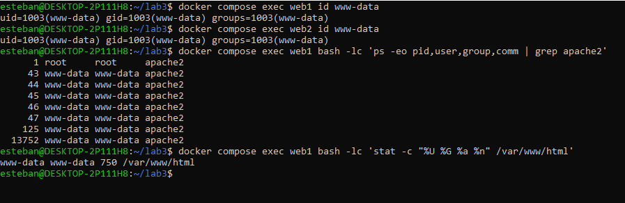

El proceso maestro de Apache (PID 1 dentro del contenedor) corre como `root:root`
(necesario para abrir el puerto privilegiado 80); todos los workers corren como
`www-data:www-data` con UID/GID `1003`, coincidiendo con el propietario real de
`/var/www/html` en el host (`750`).

### Análisis

1. **¿Por qué conviene evitar que los archivos queden propiedad de `root`?** Porque
   si se compromete el proceso Apache/PHP (que corre como `www-data`, sin
   privilegios), no podría modificar archivos propiedad de `root`, limitando el daño
   de una eventual vulnerabilidad de la aplicación.
2. **¿Qué problema se busca resolver al hacer coincidir UID/GID del contenedor con
   el host?** El problema clásico de permisos entre contenedor y bind mount: si los
   UID no coinciden, el proceso no puede leer/escribir archivos que le "pertenecen"
   de nombre pero no numéricamente en el host.
3. **¿Por qué no conviene hacer `chown -R` automático sobre todo `/var/www/html` en
   cada inicio?** Sería lento en volúmenes grandes y es innecesario si el UID/GID ya
   coincide de antemano; basta con ajustar el usuario `www-data` una vez, como hace
   el `entrypoint`.

---

## 12. Preguntas finales de reflexión

**1. ¿Qué diferencia hay entre observar una aplicación desde sus logs y observarla
desde el kernel?**

Los logs muestran lo que la aplicación decide reportar: eventos que el desarrollador
consideró relevantes. El kernel expone todo lo que realmente ocurre a bajo nivel
(syscalls, forks, I/O, planificación), sin depender de que la aplicación lo haya
instrumentado. Con eBPF se puede observar comportamiento incluso de programas que no
generan ningún log.

**2. ¿Por qué eBPF es útil en ambientes con contenedores?**

Porque los contenedores no aíslan al kernel: todos comparten el mismo. eBPF puede
observar esa capa compartida sin instalar agentes dentro de cada contenedor ni
modificar las aplicaciones, dando visibilidad transversal a todo el stack (HAProxy,
Apache, Redis, MariaDB) desde un solo punto de observación en el host.

**3. ¿Qué eventos del laboratorio corresponden a procesos?**

`sched_process_fork` y `sched_process_exec` (Prácticas 1 y 2): creación y ejecución de
procesos como `curl`, `redis-cli` y `runc`.

**4. ¿Qué eventos corresponden a red TCP/IP?**

`sys_enter_connect`, `sys_enter_accept4`, `sys_enter_sendto`, `sys_enter_recvfrom`
(Prácticas 5 y 6): apertura de conexiones y transferencia de datos entre HAProxy,
Apache y los clientes.

**5. ¿Qué eventos corresponden a almacenamiento?**

`block_rq_issue` y `block_rq_complete` (Práctica 8): actividad real de bloque en
disco, generada por MariaDB, Redis y las escrituras de WordPress.

**6. ¿Qué eventos corresponden al planificador de CPU?**

`sched_switch` (Práctica 9): cambios de contexto entre procesos, mostrando cómo el
kernel reparte tiempo de CPU.

**7. ¿Qué información sensible podría exponerse mediante trazas eBPF?**

Rutas de archivos internos (`wp-config.php`), nombres de bases de datos y tablas
(visto en la Práctica 8 con las consultas SQL), UIDs de usuarios del sistema, y
potencialmente contenido de paquetes de red si se capturaran payloads. Por eso eBPF
requiere privilegios elevados y no debe usarse sin autorización en producción.

**8. ¿Cómo se relaciona este laboratorio con los temas de procesos, memoria, I/O,
red y seguridad del sistema operativo?**

Cada práctica mapea directamente a un tema del curso: procesos (fork/exec, UID/GID,
permisos), I/O (apertura de archivos, actividad de bloque), red (syscalls de socket,
conexiones TCP), planificación (`sched_switch`, CPU-bound vs. I/O-bound) y seguridad
(namespaces, cgroups, principio de menor privilegio con `www-data`, riesgo del grupo
`docker`). El laboratorio demuestra que estos conceptos de teoría de sistemas
operativos son observables y medibles en un stack real de producción.

---

## 13. Conclusiones

- Se confirmó experimentalmente que los contenedores Docker son procesos Linux
  aislados mediante namespaces y controlados por cgroups, no máquinas virtuales con
  kernel propio.
- `bpftrace` permitió observar, sin modificar código de ninguna aplicación, la
  creación de procesos, las llamadas al sistema, la actividad de red, la actividad de
  disco y la planificación de CPU generadas por el stack completo.
- Se documentó una limitación real de WSL2 en la resolución de PIDs dentro de
  namespaces (`get_ns_current_pid_tgid, retcode: -22`), sin que esto invalidara la
  utilidad de las trazas obtenidas.
- Se evidenció, de forma práctica y reproducible, por qué Redis como backend de
  sesiones es indispensable para que la alta disponibilidad del laboratorio anterior
  sea transparente para el usuario final.
