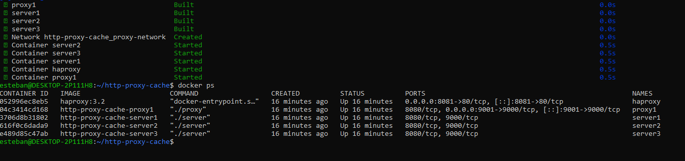
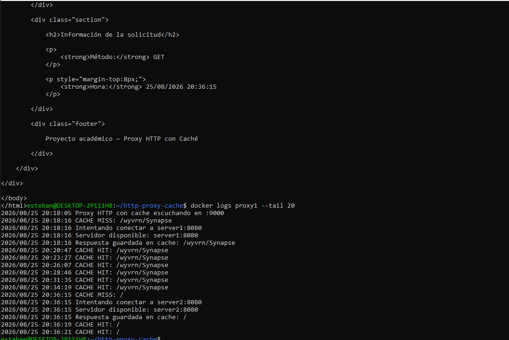
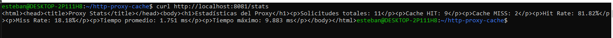
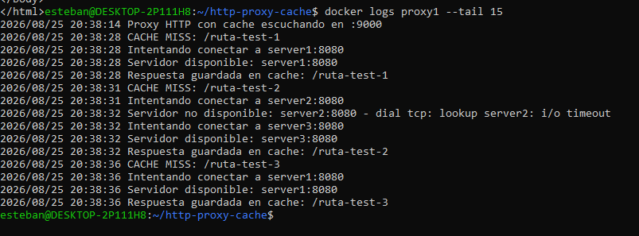
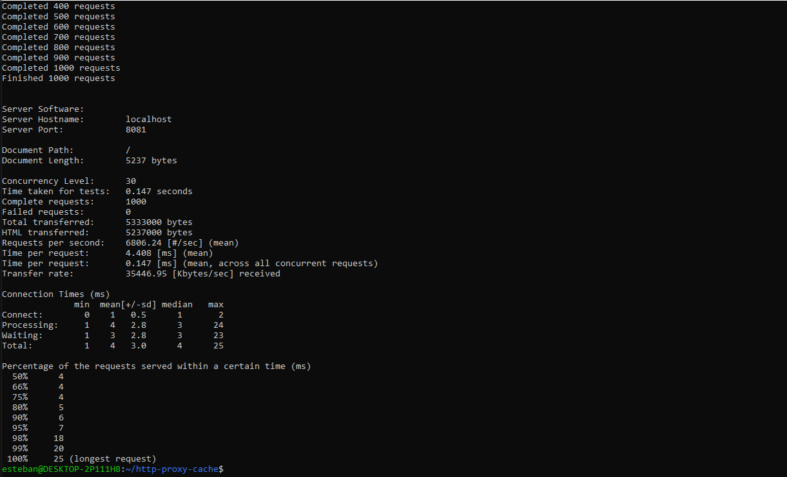
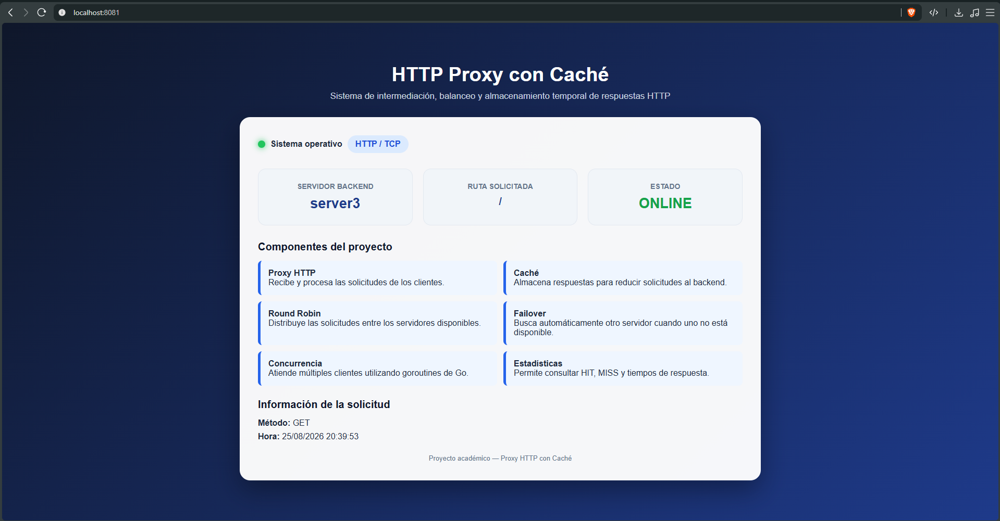

# Replicación de proyecto — Servidor Proxy HTTP con Caché en Go

**Curso:** BISOF-18 Sistemas Operativos II — Universidad Latina de Costa Rica
**Estudiante:** Esteban
**Ambiente:** WSL2 (Windows), Docker Engine, Docker Compose

## Contexto

Por indicación del profesor, se replicó el proyecto **"Servidor Proxy HTTP con Caché en Go"**, desarrollado originalmente por la compañera **Emily Nicole Hernández Ortega** ([github.com/emilyhdez35](https://github.com/emilyhdez35)), con el objetivo de observar y documentar el comportamiento real de la aplicación: su mecanismo de caché en memoria, el balanceo de solicitudes, el failover automático entre servidores backend, y su desempeño bajo una prueba de carga.

El código fuente (servidor backend, proxy Go, `Dockerfile`, `docker-compose.yml` y `haproxy.cfg`) no fue modificado — se usó tal cual fue provisto, únicamente ordenado en la estructura de carpetas indicada por el proyecto original, para levantarlo y ejecutar las pruebas descritas en su documentación.

## Arquitectura del proyecto

El sistema está compuesto por:

- **3 servidores backend** (`server1`, `server2`, `server3`) — aplicaciones Go simples que responden una página HTML identificando qué servidor atendió la solicitud.
- **1 proxy Go** (`proxy1`) — implementado con sockets TCP/IP puros (paquete `net`), que gestiona una **caché en memoria** (`map[string][]byte`), realiza **balanceo round-robin** entre los 3 backends, y aplica **failover automático** si alguno no responde. Atiende múltiples clientes de forma concurrente mediante goroutines.
- **HAProxy**, como punto de entrada final (puerto 8081), balanceando hacia el proxy Go (`proxy1:9000`).

```
Cliente → HAProxy (:8081) → Proxy Go (:9000, con caché) → server1 / server2 / server3 (:8080)
```

---

## 1. Build y despliegue de los contenedores



Se ejecutó `docker compose up --build -d`, que compiló los binarios de Go (`server` y `proxy`) mediante un build multi-stage y levantó los 5 servicios definidos: `server1`, `server2`, `server3`, `proxy1` y `haproxy`, todos con estado `Up`.

## 2. Comportamiento de la caché: Cache MISS y Cache HIT



Se realizaron tres solicitudes consecutivas a la misma ruta a través de HAProxy. El log del proxy confirmó el comportamiento esperado: la primera solicitud fue un **CACHE MISS** (el proxy conectó con `server2:8080`, obtuvo la respuesta y la guardó en memoria), mientras que las dos solicitudes siguientes fueron **CACHE HIT**, respondidas directamente desde la caché sin volver a contactar al backend.

## 3. Endpoint de estadísticas (`/stats`)



El proxy expone un endpoint especial `/stats` (no cacheable) que reporta métricas acumuladas: 11 solicitudes totales, 9 Cache HIT y 2 Cache MISS (81.82% de hit rate), con un tiempo promedio de respuesta de 1.751 ms y un máximo de 9.883 ms — la diferencia entre ambos tiempos es consistente con el costo adicional de ir hasta un backend en los MISS, frente a la velocidad de responder desde memoria en los HIT.

## 4. Failover automático ante caída de un servidor



Se detuvo el contenedor `server2` y se realizaron nuevas solicitudes a rutas distintas (para forzar Cache MISS y así probar la conexión real al backend). El log del proxy muestra que, al intentar conectar con `server2:8080`, la conexión falló (`dial tcp: lookup server2: i/o timeout`), y el proxy automáticamente probó con el siguiente servidor disponible (`server3`), completando la solicitud sin que el cliente recibiera ningún error. Esto confirma que el mecanismo de failover implementado en `connectToServer()` funciona correctamente.

## 5. Prueba de carga (1000 solicitudes, 30 clientes concurrentes)



Replicando la prueba descrita en la documentación original del proyecto, se ejecutó `ab -n 1000 -c 30 http://localhost:8081/`. Resultados obtenidos:

| Métrica | Valor |
|---|---|
| Solicitudes completadas | 1000 |
| Solicitudes fallidas | 0 |
| Requests por segundo | 6806.24 |
| Tiempo promedio por solicitud | 4.408 ms |
| Tiempo máximo (percentil 100%) | 25 ms |

El proxy se mantuvo estable durante toda la prueba, sin errores ni caídas del servicio, resultado coherente con lo reportado originalmente en la documentación del proyecto (tiempo medio de procesamiento reportado allí: 6.76 ms, en el mismo orden de magnitud que el 4.408 ms obtenido aquí).

## 6. Interfaz visible en el navegador



Se accedió a `http://localhost:8081` desde el navegador, confirmando visualmente el funcionamiento del sistema completo: la página identifica el servidor backend que atendió la solicitud (`server3` en este caso), la ruta solicitada, el método HTTP y la hora de respuesta, junto con la descripción de los componentes del proyecto (Proxy HTTP, Caché, Round Robin, Failover, Concurrencia, Estadísticas).

---

## Análisis

- **Caché en memoria:** el uso de un `map[string][]byte` protegido con `sync.RWMutex` permite respuestas casi instantáneas en los Cache HIT (1.751 ms promedio general, muy por debajo del máximo de 9.883 ms asociado a los MISS), evitando conexiones repetidas hacia los backends para contenido ya solicitado.
- **Concurrencia con goroutines:** cada conexión entrante se atiende en `go handleClient(client)`, permitiendo que el proxy maneje múltiples clientes simultáneos sin bloquear unas solicitudes con otras — evidenciado en la prueba de carga, donde 30 clientes concurrentes completaron 1000 solicitudes en apenas 0.147 segundos sin ninguna falla.
- **Round-robin y failover:** el proxy mantiene un índice compartido (`currentServer`, protegido con `sync.Mutex`) que rota entre los tres backends, y ante un fallo de conexión (`net.DialTimeout`) prueba automáticamente el siguiente servidor de la lista — un mecanismo simple pero efectivo de alta disponibilidad a nivel de aplicación, sin depender de un balanceador externo para esta función específica.
- **Rol de HAProxy en esta arquitectura:** a diferencia de otros laboratorios donde HAProxy balancea directamente entre varios servidores de aplicación, aquí HAProxy se ubica **delante del proxy Go** (`proxy1:9000`), no de los backends. Su función en este diseño es exponer un único punto de entrada estable (puerto 8081) y, según su configuración (`resolvers docker`, `check`), detectar si el propio proxy Go deja de responder — una capa adicional de disponibilidad sobre el proxy que a su vez gestiona la disponibilidad de los backends.
- **Costo/beneficio de la arquitectura:** el sistema logra reducir latencia y tráfico hacia los backends mediante caché, tolera la caída de servidores individuales mediante failover, y soporta carga concurrente significativa — pero mantiene limitaciones propias de una implementación académica: la caché no tiene política de expiración (TTL) ni límite de tamaño, por lo que en un entorno de producción real crecería indefinidamente en memoria.

## Conclusiones

- Se replicó exitosamente el proyecto de la compañera sin modificar su código fuente, confirmando que su arquitectura (proxy Go con caché, tres backends, HAProxy) funciona tal como fue diseñada.
- El mecanismo de caché en memoria demostró ser efectivo: las solicitudes repetidas se resolvieron en una fracción del tiempo que tomó la solicitud original (MISS).
- El failover automático permitió que el sistema siguiera respondiendo correctamente incluso con uno de los tres backends detenido, sin intervención manual ni errores visibles para el cliente.
- La prueba de carga (1000 solicitudes, 30 clientes concurrentes) confirmó la estabilidad del proxy bajo concurrencia real, con 0 solicitudes fallidas y un throughput de más de 6800 requests por segundo.
- Esta replicación permitió observar en la práctica varios conceptos centrales de Sistemas Operativos ya trabajados en casos anteriores — concurrencia con goroutines (análogo a threads), sockets TCP/IP de bajo nivel, y alta disponibilidad mediante failover — esta vez implementados directamente en el código de la aplicación, en lugar de delegados completamente a una herramienta externa como HAProxy.
